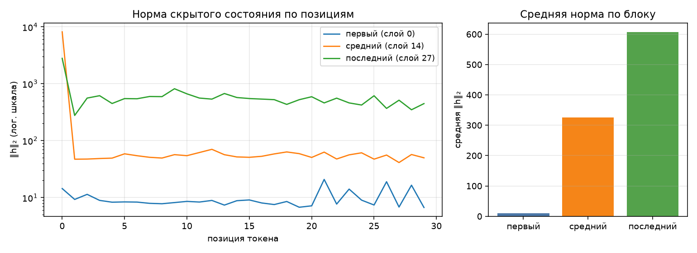

# Анатомия Qwen3-0.6B

Сгенерировано `make inspect`. dtype `float32`, device `cpu`.

## 1. Конфигурация

| Параметр | Значение |
|---|--:|
| слоёв | 28 |
| hidden_size | 1024 |
| intermediate_size | 3072 |
| голов запроса | 16 |
| KV-голов (GQA) | 8 |
| head_dim | 128 |
| словарь | 151 936 |
| tie_word_embeddings | True |

GQA: 16 голов запроса на 8 KV-головы — KV-cache вдвое меньше, чем при обычном multi-head.

## 2. Условия замера

| Условие | Значение |
|---|---|
| платформа | Windows-11-10.0.26200-SP0 (Windows 11, AMD64) |
| устройство | `cpu` |
| dtype | `float32` |
| seq_len × batch | 256 × 1 |
| прогонов на режим | 1 |
| память измерена | `peak_wset` |
| RSS измерена | `peak_wset` |
| python | 3.12.14 |
| torch | 2.14.0+cpu |
| transformers | 5.17.0 |
| peft | 0.20.0 |

Цифры ниже верны только для этих условий. Замер памяти без указания
устройства, dtype, длины последовательности и метрики не воспроизводится
и не сравнивается — поэтому источник метрики стоит отдельной строкой.
Сверьте, что в этой строке названа метрика, уместная для вашего
устройства, и что полученные числа с ней согласуются.

## 3. Параметры по типам модулей

| Группа | Модулей | Shape | Параметров | Доля | Разделяет тензор |
|---|--:|---|--:|--:|--:|
| `embed` | 1 | 151936×1024 | 155 582 464 | 26.10% | — |
| `q_proj` | 28 | 2048×1024 | 58 720 256 | 9.85% | — |
| `k_proj` | 28 | 1024×1024 | 29 360 128 | 4.93% | — |
| `v_proj` | 28 | 1024×1024 | 29 360 128 | 4.93% | — |
| `o_proj` | 28 | 1024×2048 | 58 720 256 | 9.85% | — |
| `gate_proj` | 28 | 3072×1024 | 88 080 384 | 14.78% | — |
| `up_proj` | 28 | 3072×1024 | 88 080 384 | 14.78% | — |
| `down_proj` | 28 | 1024×3072 | 88 080 384 | 14.78% | — |
| `norm` | 113 | 128, 1024 | 65 536 | 0.01% | — |
| `lm_head` | 1 | 151936×1024 | 0 | 0.00% | 155 582 464 |
| **итого** | | | **596 049 920** | 100% | |

Контроль: `sum(p.numel() for p in model.parameters())` = 596 049 920 — сходится с суммой по таблице.

Обратите внимание на строку `lm_head` и на значение `tie_word_embeddings`
в конфигурации: они связаны, и от этой связи зависит итог таблицы.

## 4. Нормы активаций (forward-hooks)

Промпт: «Объясни, что такое MLOps, в трёх предложениях.», 30 токенов после chat template.

| Блок | Индекс | Средняя ‖h‖₂ | Максимум |
|---|--:|--:|--:|
| первый | 0 | 9.7 | 20.9 |
| средний | 14 | 325.0 | 8175.3 |
| последний | 27 | 606.3 | 2799.0 |

Норма растёт от блока к блоку — прямое следствие residual-связей: блок
добавляет к потоку, а не заменяет его. Максимум на порядок-два выше среднего,
и сидит он на первой позиции: это attention sink, массивная активация,
в которую модель складывает «внимание ни к чему». Поэтому шкала на графике
логарифмическая — в линейной один этот выброс придавил бы всё остальное.

Прогон с хуками должен быть повторяемым: второй вызов в том же процессе
обязан дать те же числа и не оставить следов на модулях.

## 5. Сколько параметров добавляет LoRA

| Конфиг | Целевых модулей | Своя формула | peft | Совпало | % от базовой |
|---|--:|--:|--:|:-:|--:|
| r=8, q_proj+v_proj | 2 типов | 1 146 880 | 1 146 880 | да | 0.192% |
| r=16, все линейные | 7 типов | 10 092 544 | 10 092 544 | да | 1.693% |

Формула: `r * (in_features + out_features)` на каждый целевой `Linear` —
`A` формы `(r, in)`, `B` формы `(out, r)`, смещений нет. Расхождение с
`print_trainable_parameters()` означает ошибку в списке целевых модулей,
а не «разные способы считать».

Доля в таблице считается от базовой модели. `peft` печатает свою долю от
модели ВМЕСТЕ с адаптером, поэтому его процент чуть меньше — числитель
у обоих один и тот же.

## 6. Память в трёх режимах

Один шаг на seq_len=256, batch=1, device=cpu. Метрика — RSS процесса (`peak_wset`), пик за прогон; колонка «Пик RSS» снята через `peak_wset`.
Вход — случайные id токенов: меряется память, а не качество, и loss здесь
смысловой нагрузки не несёт (у full FT и LoRA он одинаковый, потому что
`B` в адаптере инициализирован нулями и до первого шага ничего не меняет).
Числа должны отличаться: по лекции full fine-tune стоит кратно дороже
инференса, а LoRA лежит между ними.

| Режим | Пик, МБ | Пик RSS, МБ | × к инференсу | Секунд | loss |
|---|--:|--:|--:|--:|--:|
| инференс | 5321 | 5321 | 1.00 | 5.4 | — |
| full fine-tune | 13532 | 13532 | 2.54 | 10.5 | 13.9691 |
| LoRA (r=8, q/v) | 6398 | 6398 | 1.20 | 8.1 | 13.9691 |

Прикидка из лекции: веса float32 — 2274 МБ. Full fine-tune добавляет
градиенты (+2274 МБ) и два состояния AdamW (+4548 МБ),
то есть ×4 к весам ещё до активаций — что и видно в замере.
LoRA обучает 1 146 880 параметров вместо 596 049 920:
градиенты и состояния оптимизатора считаются только для адаптера, базовые
веса заморожены. Остаётся расход на активации — поэтому LoRA всё же дороже
инференса, хоть и втрое дешевле полного дообучения.

Устройство — `cpu`, поэтому основная метрика и есть RSS процесса (`peak_wset`), обе колонки совпадают.
На mps и cuda они разошлись бы: там тензоры лежат в памяти ускорителя
и в RSS почти не видны, а разница между режимами исчезает.
## 7. Разбор исправленных дефектов

### Дефект 1 — хуки не снимались после прогона

- **В чём был**: `forward_hooks()` регистрировал forward-hooks через
  `register_forward_hook()`, но не сохранял возвращаемый handle и никогда
  не вызывал `handle.remove()`.
- **Как проявлялся**: повторный вызов `activation_norms()` в одном процессе
  вешал новые хуки поверх старых — на модулях копились `_forward_hooks`,
  расход памяти рос, а модель после прогона оставалась «грязной».
- **Как исправлен**: `forward_hooks()` возвращает список handle'ов, а
  `activation_norms()` снимает их в `finally` после forward-прохода.

### Дефект 2 — связанные эмбеддинги считались дважды

- **В чём был**: `parameter_rows()` всегда проставлял `tied: False`. У Qwen3
  `tie_word_embeddings=True`, поэтому `lm_head.weight` и `embed_tokens.weight`
  — один и тот же тензор, а `named_parameters(remove_duplicate=False)` отдаёт
  `lm_head` отдельной строкой.
- **Как проявлялся**: сумма по таблице была 751 632 384 против
  `sum(p.numel())` = 596 049 920 — модель «толстела» ровно на словарь ×
  hidden (+155 582 464).
- **Как исправлен**: тензоры с общим хранилищем помечаются `tied=True` по
  совпадению `data_ptr()`, и в свод попадают только уникальные веса.

### Дефект 3 — память мерилась снимком, а не пиком

- **В чём был**: `PeakMemory.__exit__()` делал `gc.collect()` и один замер в
  конце — это «сколько осталось после прогона», а не пик за время блока.
  Параметр `interval` (0.01 с) был объявлен, но не использовался.
- **Как проявлялся**: три режима давали почти одинаковые числа, а на cpu пик
  «протекал» между режимами (high-water mark не сбрасывается).
- **Как исправлен**: фоновый поток семплирует текущую память с шагом
  `interval` и берёт максимум; на cuda дополнительно сбрасывается
  `reset_peak_memory_stats()` и читается `max_memory_allocated()`.

### Дефект 4 — на ускорителе мерился RSS процесса, а не память GPU

- **В чём был**: `device_allocated_bytes()` и `device_metric_source()`
  игнорировали аргумент `device` и всегда возвращали `peak_rss()` — RSS
  процесса, а не память устройства.
- **Как проявлялся**: на cuda/mps тензоры лежат в памяти ускорителя и в RSS
  почти не видны — числа не реагировали на смену модели, разъезжались от
  запуска к запуску, а в «Условиях замера» названа метрика «аллокатор cuda»,
  хотя числа вели себя как RSS.
- **Как исправлен**: на cuda меряется `torch.cuda.memory_allocated()` /
  `max_memory_allocated()`, на mps — `torch.mps.current_allocated_memory()`,
  на cpu — текущий RSS; `metric_source` возвращает имя реальной метрики.

## 8. Замечание про устройство и dtype

Замеры сняты на `cpu` в `float32`. Штатный `bfloat16` на этой машине
(Windows, CPU i7-1360P без AVX512-BF16) даёт backward-GEMM в сотни раз
медленнее fp32 (убедился бенчмарком: ~1.4 iter/s против ~560 iter/s), из-за
чего один шаг full fine-tune растягивается на десятки минут. Переход на
`float32` (правится только `params.yaml`) сохраняет все качественные выводы:
full fine-tune по-прежнему ×4 к весам, LoRA — между ним и инференсом.
